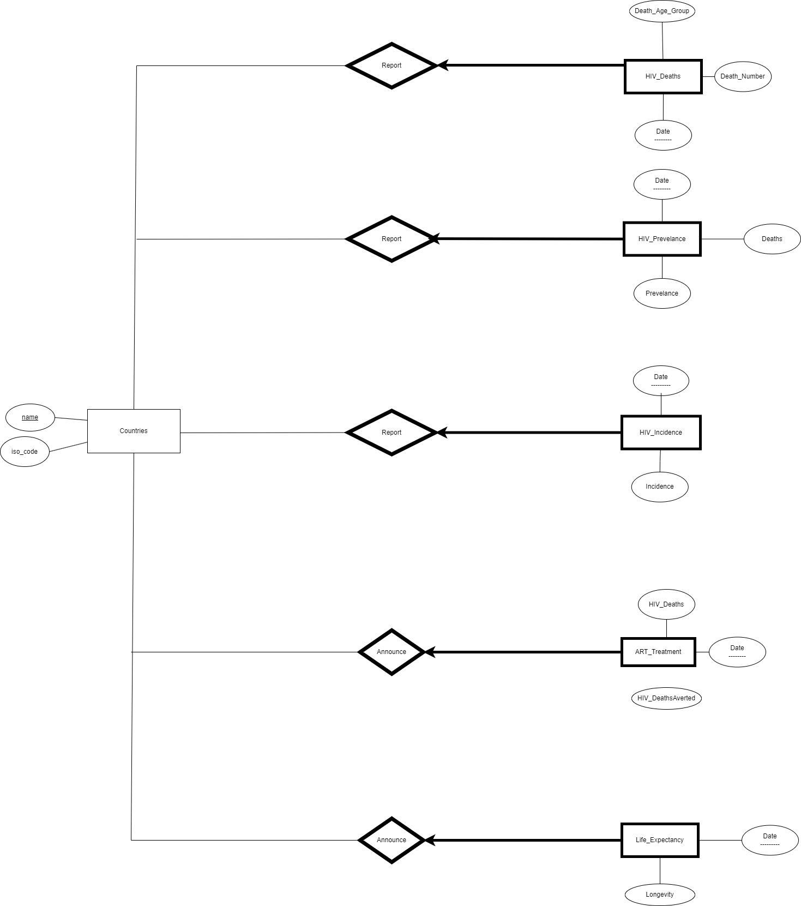

# Progress and Processes

## Step 1: Data Collection, Cleaning, Creating ER Diagram

We have gathered all the data from [Our World in Data](https://ourworldindata.org/hiv-aids) and downloaded the CSV files. We have selected to work on the CSV files for the following datasets:

- [hivaids-deaths-and-averted-due-to-art.csv](csv_files/inputs/hivaids-deaths-and-averted-due-to-art.csv)
- [deaths-from-hiv-by-age.csv](csv_files/inputs/deaths-from-hiv-by-age.csv)
- [new-cases-of-hiv-infection.csv](csv_files/inputs/new-cases-of-hiv-infection.csv)
- [life-expectancy.csv](csv_files/inputs/life-expectancy.csv)
- [deaths-and-new-cases-of-hiv.csv](csv_files/inputs/deaths-and-new-cases-of-hiv.csv)

After that, we have decided which columns we will use in our database.

Next, we have removed the unnecessary columns from the datasets and renamed filenames into our database structure. The new filenames are as follows:

- from [hivaids_deaths_and_averted_due_to_art.csv](csv_files/inputs/hivaids_deaths_and_averted_due_to_art.csv) to [art_treatment.csv](csv_files/outputs/art_treatment.csv)
- from [deaths_from_hiv_by_age.csv](csv_files/inputs/deaths_from_hiv_by_age.csv) to [death_count.csv](csv_files/outputs/death_count.csv)
- from [new_cases_of_hiv_infection.csv](csv_files/inputs/new_cases_of_hiv_infection.csv) to [incidence.csv](csv_files/outputs/incidence.csv)
- from [new_cases_of_hiv_infection.csv](csv_files/inputs/new_cases_of_hiv_infection.csv) to [prevalence.csv](csv_files/outputs/prevalence.csv)
- we have decided not to change the name [life_expectancy.csv](csv_files/inputs/life_expectancy.csv).

We have created the Entity Relationship Diagram (ERD) for our database:



Our database have the following tables:

- Countries (name, iso_code)
- HIV_Prevelance (date, country, prevelance)
- HIV_Deaths (date, country, deaths)
- HIV_Incidence (date, country, incidence)
- ART_Treatment (date, country, treatment)
- Life_Expectancy (date, country, expectancy)

While we were creating the ERD, we have decided to add the following key constraints to our database:

- `name` is a primary key in the Countries table.
- `country` is a foreign key from `Countries.name` in the following tables:
  - HIV_Prevelance
  - HIV_Deaths
  - HIV_Incidence
  - ART_Treatment
  - Life_Expectancy
- Date is a partial key in the following weak entities:
  - HIV_Prevelance
  - HIV_Deaths
  - HIV_Incidence
  - ART_Treatment
  - Life_Expectancy

We have these relationships between the tables:

- `Countries` (entity) `Report` (relation) via one-to-many relationship:
  - HIV_Prevelance
  - HIV_Deaths
  - HIV_Incidence

- `Countries` (entity) `Announce` (relation) via one-to-many relationship:
  - ART_Treatment
  - Life_Expectancy

## Step 2: Creating Database and Importing Data

We have created the database in MySQL Workbench. We have created the following tables:

- Countries (name, iso_code)

  Because some countries do not have an ISO code, we have decided to make the `iso_code` column nullable.
  Because some data in Entity column from original files are not countries, they are unnecessarily long, so in order to add them to the database, we have decided to make the `name` column 200 characters long. Likewise, we have decided to make the `iso_code` column 100 characters long in order to add the ISO codes of non-country entities. (e.g. "World"). We have decided to make the `name` column the primary key of the table.

```sql
CREATE TABLE Countries
(country VARCHAR(200),
iso_code varchar(100),
PRIMARY KEY(country));
```

- Reported_HIV_Prevelance (country, date, prevelance, deaths)

```sql
CREATE TABLE Reported_HIV_Prevelance
(country VARCHAR(50),
date INTEGER,
prevelance double,
deaths INTEGER,
PRIMARY KEY (country,date),
FOREIGN KEY (country) REFERENCES Countries(country) ON DELETE CASCADE
);
```

- Reported_HIV_Deaths (country, date, death_70plus, death_50_69, death_15_49, death_5_14, death_under5)

```sql
CREATE TABLE Reported_HIV_Deaths(
country VARCHAR(200),
date INTEGER,
death_70plus INTEGER,
death_50_69 INTEGER,
death_15_49 INTEGER,
death_5_14 INTEGER,
death_under5 INTEGER,
PRIMARY KEY (country,date),
FOREIGN KEY (country) REFERENCES Countries(country) ON DELETE CASCADE
);
```

- Reported_HIV_Incidence (country, date, incidence)

```sql
CREATE TABLE Reported_HIV_Prevelance
(country VARCHAR(50),
date INTEGER,
prevelance double,
deaths INTEGER,
PRIMARY KEY (country,date),
FOREIGN KEY (country) REFERENCES Countries(country) ON DELETE CASCADE
);
```

- ART_Treatment_Announcement (country, date, hiv_death, deaths_averted)

```sql
CREATE TABLE ART_Treatment_Announcement 
(country VARCHAR(50),
date INTEGER,
hiv_death FLOAT,
deaths_averted FLOAT,
PRIMARY KEY (country, date),
FOREIGN KEY (country) REFERENCES Countries(country) ON DELETE CASCADE
);
```

- Life_Expectancy_Announcement (country, date, longevity)

```sql
CREATE TABLE Life_Expectancy_Announcement (
  country VARCHAR(200),
  date INTEGER,
  longevity FLOAT,
  PRIMARY KEY (country, date),
  FOREIGN KEY (country) REFERENCES Countries(country) ON DELETE CASCADE
);
```

We have imported the data into the database using the following commands:

```sql
LOAD DATA LOCAL INFILE 'csv_files/outputs/art_treatment.csv' INTO TABLE ART_Treatment_Announcement FIELDS TERMINATED BY ',' ENCLOSED BY '"' LINES TERMINATED BY '\n' IGNORE 1 ROWS;

LOAD DATA LOCAL INFILE 'csv_files/outputs/death_count.csv' INTO TABLE Reported_HIV_Deaths FIELDS TERMINATED BY ',' ENCLOSED BY '"' LINES TERMINATED BY '\n' IGNORE 1 ROWS;

LOAD DATA LOCAL INFILE 'csv_files/outputs/incidence.csv' INTO TABLE Reported_HIV_Incidence FIELDS TERMINATED BY ',' ENCLOSED BY '"' LINES TERMINATED BY '\n' IGNORE 1 ROWS;

LOAD DATA LOCAL INFILE 'csv_files/outputs/life_expectancy.csv' INTO TABLE Life_Expectancy_Announcement FIELDS TERMINATED BY ',' ENCLOSED BY '"' LINES TERMINATED BY '\n' IGNORE 1 ROWS;

LOAD DATA LOCAL INFILE 'csv_files/outputs/prevalence.csv' INTO TABLE Reported_HIV_Prevelance FIELDS TERMINATED BY ',' ENCLOSED BY '"' LINES TERMINATED BY '\n' IGNORE 1 ROWS;
```

## Step 3: Creating Views

### Part 1

#### a)

```sql
CREATE VIEW HIV_DEATHS_BIGGER as Select country, date, deaths
FROM reported_hiv_prevelance
WHERE deaths > 29000;```

This code creates a view for HIV deaths table that has deaths greater than 29000,
which is the average number.

```sql
CREATE VIEW HIV_DEATHS_SMALLER as Select country, date, deaths
FROM reported_hiv_prevelance
WHERE deaths < 29000;
```

This code creates a view for HIV deaths table that has deaths less than 29000.

```sql
CREATE VIEW HIV_INCIDENCE_BIGGER as Select country, date, incidence
FROM reported_hiv_incidence
WHERE incidence > 62000;
```

This code creates a view for HIV incidences table that has incidences greater than
62000, which is the average number.

```sql
CREATE VIEW HIV_INCIDENCE_LESSER as Select country, date, incidence
FROM reported_hiv_incidence
WHERE incidence < 62000;
```

This code creates a view for HIV incidences table that has incidences less than 62000.

```sql
CREATE VIEW HIV_DEATH_AVERTED as Select country, date, hiv_death,
deaths_averted
FROM art_treatment_announcement
WHERE hiv_death > 27000 AND deaths_averted > 14000;
```

This code creates a view for HIV deaths averted table that has deaths averted greater
than 14000, and HIV deaths that are greater than 27000, which are average numbers
for both of them.

#### b)

```sql
SELECT count(*) FROM HIV_INCIDENCE_BIGGER B WHERE
B.country NOT IN (SELECT S.country FROM HIV_DEATHS_BIGGER S WHERE
S.country = B.country and S.date = B.date); -- This one is to create with NOT IN
method
SELECT count(*) FROM hiv_incidence_bigger B
LEFT OUTER JOIN hiv_deaths_bigger S
on B.country = S.country and S.date = B.date WHERE S.country is NULL and S.date
is NULL; -- This one is to create with LEFT OUTER JOIN method
```

Both code blocks create the same thing, which gives us countries having HIV
incidences that are greater than average; however, have less HIV deaths that are less
than average.

#### c)

```sql
SELECT *FROM hiv_incidence_lesser B WHERE
B.country IN (SELECT S.country FROM hiv_death_averted S WHERE S.country =
B.country and S.date = B.date); -- This one is to create with IN method.
SELECT* FROM hiv_incidence_lesser B WHERE EXISTS
(SELECT S.country FROM hiv_death_averted S WHERE S.country = B.country and
S.date = B.date); -- This one is to create with EXISTS method.
```

Both code blocks create the same thing, which gives us countries having HIV
incidences that are less than the average, but have more HIV deaths and deaths
averted than their averages.

#### d)

```sql
SELECT S.country, COUNT(D.date) as NumberOfReports FROM
reported_hiv_deaths S
LEFT OUTER JOIN reported_hiv_prevelance D ON (S.country = D.country and
S.date = D.date)
GROUP BY S.country
HAVING COUNT(D.date) < 10;
```

This code gives us the countries which are in HIV prevalence table, but not in the
HIV deaths table. (Aggregate operator COUNT)

```sql
SELECT S.country, SUM(S.death_70plus) as Death70Plus , sum(S.death_50_69) as
Death50_69, sum(S.death_15_49) as Death15_49, SUM(S.death_5_14) as
Death5_14, SUM(S.death_under5) as DeathUnder5,
SUM(D.deaths) as TotalDeaths,
SUM(S.death_under5 + S.death_5_14 + S.death_15_49 + S.death_50_69 +
S.death_70plus ) as AdditionOfAgeGroupDeath,
SUM(S.death_under5 + S.death_5_14 + S.death_15_49 + S.death_50_69 +
S.death_70plus - D.deaths) AS Difference FROM reported_hiv_deaths S
LEFT OUTER JOIN reported_hiv_prevelance D ON (S.country = D.country and
S.date = D.date)
GROUP BY S.country
HAVING Difference >= -10 and Difference <= 10;
```

This code block gives us the total deaths of each age group and the total death caused
by HIV, having a restriction that the difference between prevalence table’s death and
reported HIV death’s death numbers are between -10, and 10, meaning that they will
be close to each other. (Aggregate operator SUM)

```sql
SELECT S.country, CAST(AVG(S.deaths) AS decimal(10,2)) AS Average_Death,
CAST(AVG(D.deaths_averted) AS decimal (10,2)) As Average_Death_Averted
FROM reported_hiv_prevelance S
LEFT OUTER JOIN art_treatment_announcement D ON (S.country = D.country and
S.date = D.date)
group by S.country
HAVING Average_Death_Averted is not NULL;
```

This code block gives us the countries with their average death and their average
death averted numbers. (Aggregate operator AVG)

```sql
SELECT S.country, MAX(S.longevity) as Longevity, MAX(D.deaths_averted) as
Deaths_averted FROM life_expectancy_announcement S
LEFT OUTER JOIN art_treatment_announcement D ON (S.country = D.country and
S.date = D.date)
group by S.country
HAVING Deaths_Averted is not Null;
```

This code block gives us the countries with maximum life expectancy and deaths
averted that was reported by them. (Aggregate operator MAX)

```sql
SELECT S.country, MIN(S.longevity) as Longevity, MIN(D.deaths) as Deaths,
MIN(K.incidence) as Incidence FROM life_expectancy_announcement S
LEFT OUTER JOIN reported_hiv_prevelance D ON (S.country = D.country and
S.date = D.date) LEFT OUTER JOIN reported_hiv_incidence K ON (S.country =
K.country and S.date = K.date)
group by S.country
HAVING Deaths is not NULL and incidence is not null;
```

This code gives us the countries with their minimum life expectancy, deaths, and
incidences they have reported. (Aggregate operator MIN)

### Part 2

```sql
ALTER TABLE reported_hiv_prevelance ADD CONSTRAINT deaths_bigger_zero
CHECK(deaths >= 0 and deaths <= 1844490);
In this code, we added a constraint for HIV prevalence table that the death number
must be between 0 and 1844490, which are the minimum and maximum numbers for deaths.
delimiter //
CREATE TRIGGER death_number_check BEFORE INSERT ON
reported_hiv_prevelance
FOR EACH ROW
BEGIN
IF NEW.deaths < 0 THEN SET NEW.deaths = 0;
ELSEIF NEW.deaths > 1844490 THEN SET NEW.deaths = 1844490;
 END IF;
END;//
delimiter ;
```

In this code, we added a trigger for HIV prevalence table that the death number

```sql
delimiter //
CREATE TRIGGER death_number_check_update BEFORE UPDATE ON
reported_hiv_prevelance
FOR EACH ROW
BEGIN
IF NEW.deaths < 0 THEN SET NEW.deaths = 0;
ELSEIF NEW.deaths > 1844490 THEN SET NEW.deaths = 1844490;
 END IF;
END;//
delimiter ;
```

These two code blocks do the same thing. The first one converts the inputs less than 0
to 0, and converts the inputs greater than 1844490 to 1844490 when death number is
inserted. Second one does the same thing when an input is updated, not inserted.

### Part 3

```sql
delimiter //
CREATE PROCEDURE bringALL(input VARCHAR(100))
BEGIN
SELECT S.country, S.date, S.longevity as Longevity, D.deaths as Deaths,
K.incidence as Incidence, L.deaths_averted as Death_Averted FROM
life_expectancy_announcement S
LEFT OUTER JOIN reported_hiv_prevelance D ON (S.country = D.country
and S.date = D.date) LEFT OUTER JOIN reported_hiv_incidence K ON
(S.country = K.country and S.date = K.date)
LEFT OUTER JOIN art_treatment_announcement L ON (S.country =
L.country and S.date = L.date) WHERE input = S.country;

END; //
delimiter ;
```

This code block allows us to get countries and their features such as report date, life
expectancy, death reports, incidence reports, and averted death reports.
General constraint methods allow us protect data integrity since a user may enter a
false information such as death number being less than 0. On the other hand, trigger
method converts this number to 0, and due to that we can have more information
about a topic unlike general constraint methods. However, because of this conversion,
we may have wrong information about a feature. For instance, if the user enters
2000000 deaths, it will be converted to 1844490, but it is a wrong number.
